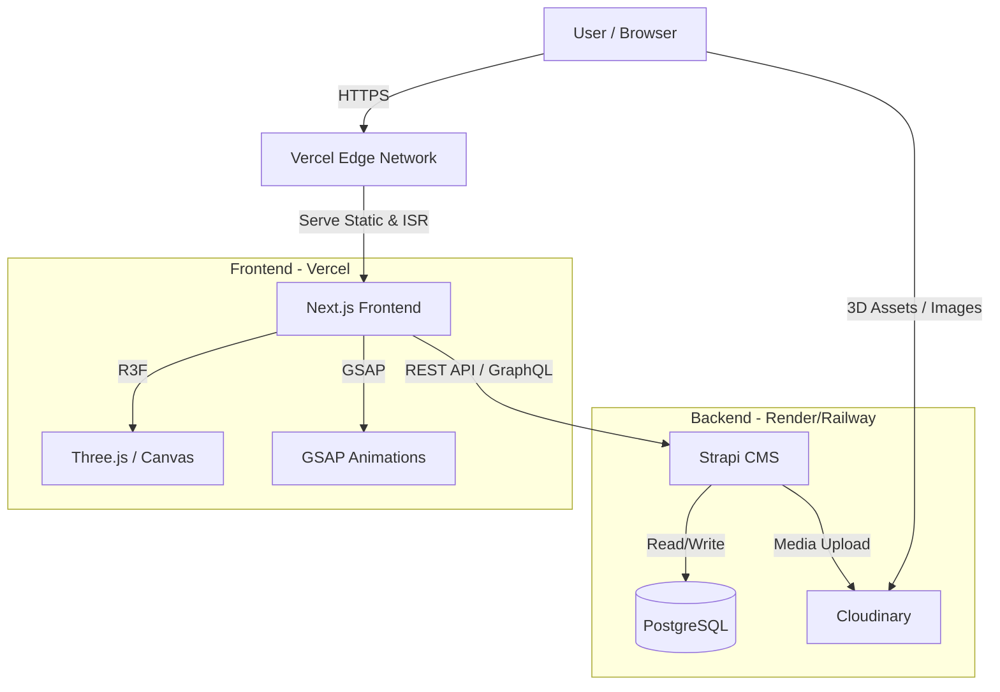

# Design & Architecture - Electric Vehicle Website

## 1. System Architecture

### Overview
The system follows a **Headless CMS** architecture, separating the presentation layer (Frontend) from the content management layer (Backend).



### Data Flow
1.  **Content Creation**: Admin inputs car data, specs, and uploads 3D models (GLB) to Strapi. Strapi uploads media to Cloudinary.
2.  **Build Time (SSG/ISR)**: Next.js fetches data from Strapi API to generate static pages (Listing, Detail, Blog).
3.  **Runtime (Client)**: 
    - React Three Fiber loads GLB models from Cloudinary URLs.
    - User interactions (Color change, Config) update the 3D state locally.
    - Forms (Lead/Deposit) submit data to Strapi API endpoints.

## 2. Data Model (Strapi Schema)

### `CarModel` (Dòng xe)
- `name` (Text): Tên dòng xe (e.g., "VF 8", "Model S").
- `slug` (UID): URL friendly ID.
- `brand` (Text): Thương hiệu.
- `description` (Rich Text): Mô tả chung.
- `thumbnail` (Media): Ảnh đại diện.
- `heroImage` (Media): Ảnh cover lớn.
- `versions` (Relation): 1-to-many với `CarVersion`.

### `CarVersion` (Phiên bản)
- `name` (Text): Tên phiên bản (e.g., "Eco", "Plus").
- `price` (Number): Giá bán.
- `range` (Number): Quãng đường di chuyển (km).
- `topSpeed` (Number): Tốc độ tối đa (km/h).
- `batteryCapacity` (Number): Dung lượng pin (kWh).
- `acceleration` (Number): 0-100km/h (s).
- `colors` (Relation): Many-to-many với `CarColor`.
- `model` (Relation): Belongs to `CarModel`.

### `CarColor` (Màu sắc)
- `name` (Text): Tên màu (e.g., "Deep Ocean", "VinFast Blue").
- `hexCode` (String): Mã màu hiển thị UI (#RRGGBB).
- `textureMap` (Media): Texture map nếu cần cho 3D material.

### `Car3DAsset` (Asset 3D)
- `model` (Relation): Belongs to `CarModel` or `CarVersion`.
- `glbFile` (Media): File .glb/.gltf.
- `initialCameraPosition` (JSON): `{x: 0, y: 1, z: 5}`.
- `environmentMap` (Media): HDR file (optional).

### `Lead` (Khách hàng)
- `fullName` (Text)
- `email` (Email)
- `phone` (Text)
- `type` (Enumeration): `TestDrive`, `Deposit`, `Consultation`.
- `message` (Text)
- `interestedCar` (Relation): Link to `CarModel`.

## 3. Folder Structure

### Frontend (`/frontend`)
```
frontend/
├── app/
│   ├── layout.tsx       # Root layout (Fonts, Metadata)
│   ├── page.tsx         # Home page (Hero 3D, Sections)
│   ├── cars/
│   │   ├── page.tsx     # Listing page
│   │   └── [slug]/
│   │       └── page.tsx # Car Detail page
│   ├── blog/            # Blog routes
│   └── contact/         # Contact/Test Drive form
├── components/
│   ├── 3d/              # R3F Components
│   │   ├── CarViewer.tsx
│   │   ├── Experience.tsx
│   │   └── Stage.tsx
│   ├── ui/              # Reusable UI (Buttons, Cards)
│   │   ├── Button.tsx
│   │   ├── CarCard.tsx
│   │   └── Navbar.tsx
│   └── sections/        # Page Sections (Hero, Features)
├── hooks/
│   ├── useStore.ts      # Zustand state (if needed)
│   └── useScroll.ts     # GSAP ScrollTrigger hook
├── lib/
│   ├── api.ts           # Strapi fetcher
│   ├── utils.ts         # Helper functions
│   └── constants.ts
├── public/              # Static assets
└── styles/
    └── globals.css      # Tailwind directives
```

### Backend (`/backend`)
Standard Strapi structure:
```
backend/
├── config/              # Database, Server config
├── src/
│   ├── api/             # API Resources (Car, Lead, etc.)
│   │   ├── car-model/
│   │   ├── car-version/
│   │   └── lead/
│   ├── admin/           # Admin panel customization
│   └── extensions/      # Plugin extensions
├── public/              # Local uploads (dev only)
└── .env                 # Environment variables
```

## 4. Tech Stack & Deployment
- **Frontend**: Next.js 14+ (App Router), TypeScript, Tailwind CSS.
- **3D**: React Three Fiber, Drei, Three.js.
- **Animation**: GSAP (GreenSock).
- **Backend**: Strapi v4/v5.
- **Database**: PostgreSQL.
- **Deployment**:
    - Frontend: Vercel (Auto-deploy from Git).
    - Backend: Render (Web Service for Strapi + Managed PostgreSQL).
